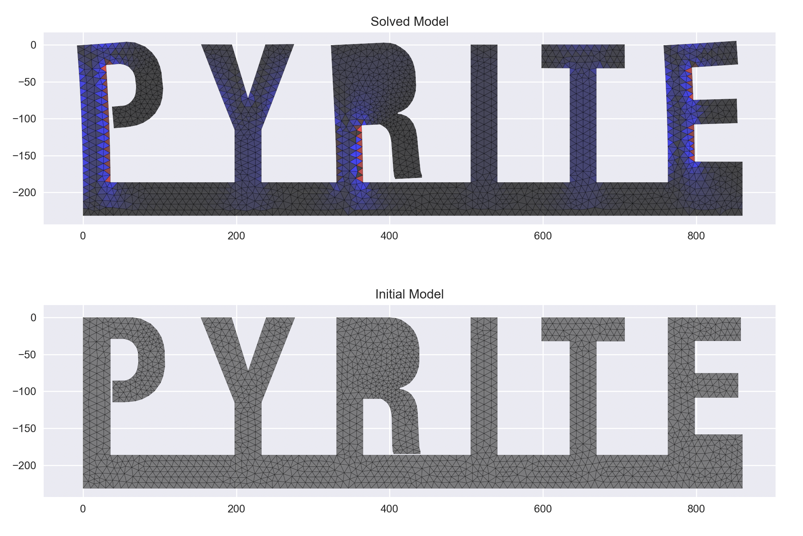

# Pyrite

A 2D linear-elastic FEA program for isotropic materials, built in Python.



## Installation & Running

You can install pyrite with

```
pip install .
```

You will also need [Gmsh](https://gmsh.info/#Download) installed on your machine.

Afterward, you can run pyrite with:

```
pyrite my_geom.svg input.json
```

For help with more commands, run:

```
pyrite -h
```

## About

I built Pyrite to learn more about the finite element method. It's aim isn't to be exceptionally performant—it's mainly about getting all the pieces connected.

Pyrite takes the following steps to arrive at a static mechanical solution:

1. It first parses a `.svg` file into a list of vertices.
2. Using [Gmsh](https://gmsh.info/), these vertices define the boundary of a 2D mesh.
3. Pyrite parses this mesh into a list of nodes and elements. It will apply boundary conditions from an input JSON file.
4. Each element calculates its stiffness matrix; these are then compiled into a total stiffness matrix
5. Using numpy's `linalg` module, Pyrite sets up the finite element equation and solves for unknown nodal forces and displacements.
6. The solution is plotted next to the initial model using matplotlib.

## Examples

This repo contains two examples in the `examples/` dir. 

## Limitations

- Python is slow, and moderately large models will solve very slowly. Pyrite is a prototype for a much more performant solver I am planning to build in Rust.

- Pyrite currently only supports **simply connected regions**, i.e., regions that have no "holes". This is an artifact of having a single list of vertices.

- Pyrite is only linear-elastic. Once stresses exceed the yield strength of the material, Pyrite will not accommodate plastic behavior

- There is no contact recognition, meaning that a part can clip within itself.

> Many more limitations are inherent with a single-part, 2D, isotropic linear-elastic static mechanical solver; the list above highlights the most restrictive of these.

## Citations

The equations used to obtain stiffness matrices were derived in this [University of New Mexico Paper](https://www.unm.edu/~bgreen/ME360/2D%20Triangular%20Elements.pdf).

More information is found on this [Wikipedia page](https://en.wikipedia.org/wiki/Finite_element_method)
