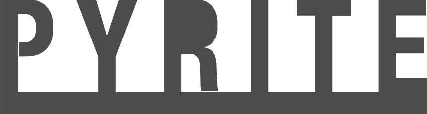

# Cover Example

This example will recreate the image shown on the main repo's README.

We will use a svg as our input geometery. This SVG spells out the Pyrite logo:



The input file for this simulation looks like:
```json
{
  "metadata": {
    "part_thickness": 0.5,
    "material_elasticity": 69e9,
    "poisson_ratio": 0.33
  },
  "boundary_conditions": {
    "restraint": {
      "region": {
        "y_target_min": -240,
        "y_target_max": -220
      },
      "targets": {
        "ux": 0,
        "uy": 0,
        "fx": null,
        "fy": null
      }
    },
    "load": {
      "region": {
        "y_target_min": -20,
        "y_target_max": 3
      },
      "targets": {
        "ux": null,
        "uy": null,
        "fx": 0,
        "fy": 5e7
      }
    }
  }
}

```

If you want to set up a input file before running the simulation, run pyrite with the `-s` flag, which will display the mesh before solving.

### Running

Now that we have our geometry and input json, we can  run this study with:

```
pyrite pyrite.svg input.json -cl 15 -cv 5
```

The `-cl 15` flag sets the characteristic length of the mesh to 15 and the `-cv 5` flag sets the characteristic length variance to 5. These are both mesh parameters.

Once this is done solving, we will 